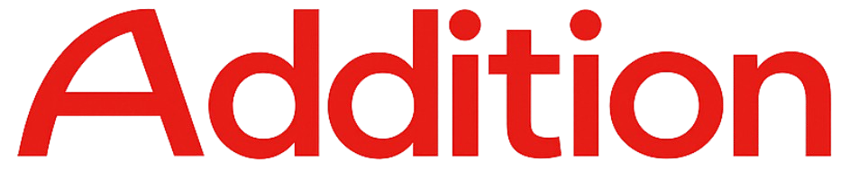

  

<h1 align="center">/ADD PROTOCOL (ADDITION)</h1>

<b>The Final Financial Layer for the Machine Economy</b>

  
  
  
  

---

## ?? The Sovereign Blockchain Evolution
Addition (/ADD) is a Layer 1 blockchain engineered to solve the "Triple Crisis" of current networks: **Quantum Vulnerability, Infinite Inflation, and Total Surveillance.** 

While legacy networks like Ethereum and Solana rely on aging ECDSA/Ed25519 signatures, Addition is built on **ML-DSA-87 (Module-Lattice-Based Digital Signature Algorithm)** in strict mode, ensuring absolute cryptographic immunity for the next 50 years.

### ?? Competitive Superiority: The Hard Truth

| Feature | **Addition (/ADD)** | **Solana (SOL)** | **Ethereum (ETH)** | **Bitcoin (BTC)** |
| :--- | :--- | :--- | :--- | :--- |
| **Quantum Resistance** | **YES (NIST Level 5)** | NO (Vulnerable) | NO (Vulnerable) | NO (Vulnerable) |
| **Max Supply** | **50,000,000 (Fixed)** | ~580M (Inflation) | Infinite (Variable) | 21,000,000 |
| **Privacy Engine** | **Native Privacy Pools** | Public Only | Public Only | Public Only |
| **Consensus** | **Hybrid PoW + Stake** | Centralized PoS | Proof of Stake | Proof of Work |
| **Institutional Trust** | **Registered Fed Entity** | Private Foundation | Non-Profit Org | None |

---

## ??? Core Infrastructure Pillars

### 1. Post-Quantum Security (NIST Level 5)
Addition is the first production-ready blockchain to enforce ML-DSA-87 signatures. This prevents "Harvest Now, Decrypt Later" attacks, securing assets against future quantum computers that will compromise 99% of existing digital wallets.

### 2. Hyper-Scarcity Tokenomics
With a fixed supply of **50 million /ADD**, our protocol is 10x scarcer than Solana. 
*   **Genesis Sale Price**: $0.60 USD
*   **Genesis Allocation**: Only 10,000 /ADD available for public acquisition.
*   **Economic Goal**: Maximum value retention for early network participants.

### 3. Integrated Privacy Pools
Unlike transparent chains where your wealth is public, Addition integrates **Native Privacy Pools** (src/privacy.cpp). High-net-worth individuals and institutions can transact with mathematical anonymity without leaving the L1.

---

## ?? Global Ecosystem

*   **Official Gateway**: [XA1.AI](https://xa1.ai) | [BNKS.AI](https://bnks.ai) | [PEKIN.AI](https://pekin.ai)
*   **Acquisition**: Direct Fiat Gateway via Stripe/PayPal integrated on all portals.
*   **Developer Suite**: Token Factory Pro for instant deployment of PQ-secure assets.
*   **Interoperability**: Native EVM Bridge for seamless liquidity flow.

---

## ?? Governance & Legal
Addition is backed by a **legally registered Canadian Federal Entity**. We combine the decentralization of "Code is Law" with the trust of real-world legal accountability.
[View Federal Registry Details](https://ised-isde.canada.ca/cc/lgcy/fdrlCrpDtls.html?p=0&corpId=17632274&crpNm=addison&crpNmbr=&bsNmbr=&cProv=&cStatus=&cAct=)

---

  <h3>Network Showcase</h3>
  <video src="docs/assets/promo.mp4" width="800" controls muted autoplay loop>
    Your browser does not support the video tag.
  </video>

   
  <b>Developed with precision. Secured for the future. This is Addition.</b> 
  <i>© 2026 Addition Network. The Final Financial Layer.</i>

